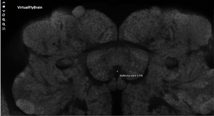

# nBLAST4Py
A high-performance Python implementation of NBLAST neuron search algorithm adapted from the R package nat.nblast (https://github.com/natverse/nat.nblast)

## Setup
### Install Boost.Python
See the project's [GitHub repository](https://github.com/boostorg/python#build) for generic instructions. However, an alternative strategy was needed for installation on a Windows machine using MinGW ([details here](boostPythonWinMinGW.md))
### Install Libnabo
Again, the [GitHub repository](https://github.com/ethz-asl/libnabo#compilation) contains generic instructions; Windows-specific details are [here](libnaboWin.md). Once you have built Pynabo, the library's C extension for Python, then copy it to the DLLs directory of your Python installation, along with any DLLs on which it may depend, chiefly Boost.Python.
### Install Python packages
Either create a virtualenv using the given Pipfile and [`pipenv`](https://github.com/pypa/pipenv), or simply install `numpy`, `feather-format`, and `pandas` system-wide using `pip`.
### Populate `skeletons` directory with SWC files
The neuron database used by this developer was Hemibrain (for _Drosophila_); see the project overview [here](https://www.janelia.org/project-team/flyem/hemibrain) and download the database of 21,663 neurons [here](https://storage.cloud.google.com/hemibrain-release/skeletons.tar.gz).

If another database is used, then minor modification to the code would be needed because two constants (`HEMI_ORIGIN_TO_BRAIN_CENTER` and `MICROMETER_TO_HEMI_PIXELS`) are Hemibrain specific and would need to be parameterized or generalized.

## Usage
### Prerequisites
- Z-stack image of neurons to query; it must already have undergone registration, using a tool such as [CMTK](https://www.nitrc.org/projects/cmtk/).
- Coordinates in µm of the point in the brain shown here, namely, the center of the negative space between the ellipsoid body and the nodulus, with respect to the upper left corner of the scanned image.
  - For images registered to the template [FCWB](http://natverse.org/nat.flybrains/reference/FCWB.html), this point's location is (281, 105, 54).
  - For animals other than Drosophila, an analogous reference point would need to be defined, and the constant `HEMI_ORIGIN_TO_BRAIN_CENTER` would need to be modified.
  - 
### Steps
1. Annotate a neuron from your image
    - [Simple Neurite Tracer](https://imagej.net/Simple_Neurite_Tracer), a plugin of [ImageJ](https://imagej.net/Welcome) or [Fiji](https://fiji.sc/)) is recommended, but any tool works as long as it outputs an SWC file.
2. Run NBLAST search
    - Example: `python findNeuronMatches.py -q ${YOUR_SWC_FILE} --anatO 281,105,54`
    - Use `-h` argument for full documentation of options
    - **Note: if using Hemibrain, use `reflectX` if your query neuron is on the right-hand side, but has a left-hand analog (Hemibrain only covers the region shown here in blue)** 
