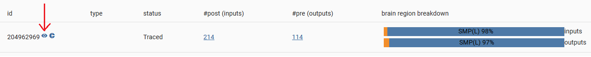

# nBLAST4Py
A high-performance Python implementation of the NBLAST neuron search algorithm adapted from the R package nat.nblast (https://github.com/natverse/nat.nblast)

## Setup
### Install Python
#### For Ubuntu
[These instructions](https://tecadmin.net/install-python-3-8-ubuntu/) yielded success; the only additions are that 1) the flag `--enable-shared` must be passed when calling `configure` and 2) afterward, the command `sudo ldconfig /usr/local/lib` is required to be able to install Python packages.
#### For Windows
The [installer executables](https://www.python.org/downloads/) provided by the Python Software Foundation worked well.
### Install Boost.Python
See the project's [GitHub repository](https://github.com/boostorg/python#build) for generic instructions.

[Details specific to Ubuntu](boostUbuntu.md)

[Details specific to Windows machines using MinGW](boostPythonMinGW.md)
### Install Libnabo
Again, the [GitHub repository](https://github.com/ethz-asl/libnabo#compilation) contains generic instructions.

[Details specific to Ubuntu](libnaboUbuntu.md)

[Details specific to Windows machines using MinGW](libnaboWin.md)
### Install Python packages
Either create a virtualenv using the given Pipfile and [`pipenv`](https://github.com/pypa/pipenv), or simply install `numpy`, `feather-format`, and `pandas` system-wide using `pip`.
### Populate `skeletons` directory with SWC files
This project was originally designed for use with the Hemibrain database of _Drosophila_ neurons; see the project overview [here](https://www.janelia.org/project-team/flyem/hemibrain).To use Hemibrain, simply unzip the file `hemibrainSkeletons.zip` and copy the results to the `skeletons` directory, or instead copy your own SWC files to that directory.

## Usage
### Prerequisites
- Z-stack image of neurons to query; it must already have undergone registration, using a tool such as [CMTK](https://www.nitrc.org/projects/cmtk/).
    - Note: the Hemibrain target neurons have been transformed to the [`JRC 2018 central brain Female` template](https://www.janelia.org/open-science/jrc-2018-brain-templates); if your registration used a different template, then it is necessary to transform either your image or the skelet
### Steps
1. Register your brain image stack to a template image, using a tool such as [CMTK](https://www.nitrc.org/projects/cmtk/)
    - Note: for Hemibrain, the [JRC 2018 central brain Female](https://www.janelia.org/open-science/jrc-2018-brain-templates) template is recommended because the target neurons in `hemibrainSkeletons.zip` have already been transformed to align with it.
    - If you use a different template for your registration, then either your image or your annotated skeleton needs to be transformed to the above-mentioned template, using CMTK or the scripts in the repo [`saalfeldlab/template-building`](https://github.com/saalfeldlab/template-building).
2. Annotate a neuron from your image.
    - [Simple Neurite Tracer](https://imagej.net/Simple_Neurite_Tracer) (plugin of [ImageJ](https://imagej.net/Welcome) or [Fiji](https://fiji.sc/)) is recommended, but any tool works as long as it outputs an SWC file.
3. Run NBLAST search.
    - Example: `python findNeuronMatches.py ${YOUR_SWC_FILE}`
    - Use `-h` argument for full documentation of options
    - Note: Hemibrain only covers the blue region in the image below, and so if your query neuron is on the right-hand side, then use the `--reflectX` option to search for your query neuron's left-handed analogous pair.
    - 
4. Inspect results.
    - The search script outputs a JSON file assigning a score to each target neuron in the target database, with a higher score implying a better match with the query neuron.
    - For Hemibrain search:
      - Visit Hemibrain's [neuPrintExplorer](https://neuprint.janelia.org/?dataset=hemibrain:v1.0.1&qt=findneurons).
      - Click the search icon (magnifying glass) in the left-hand sidebar, and copy and paste the numeric ID of a skeleton from the results file (e.g., 204962969); click on the result that appears under the header "Body IDs," of which there should be only one.
      - In the table of results, click the small eye icon beside the neuron ID and two visualizers will appear: Neuroglancer, which superimposes the skeleton and synapses of the neuron against the raw Hemibrain image data, and a simple skeleton viewer. The former is essential to determine whether the target neuron is located in the expected region of the brain.
      - 
    - For non-Hemibrain search:
      - The above-mentioned results file is the final output of this program, and further analysis and visualization would need to be implemented separately.

## Development
### Running tests
`python -m pipenv run pytest --cov=.\ --cov-report html --html=report.html tests/`
